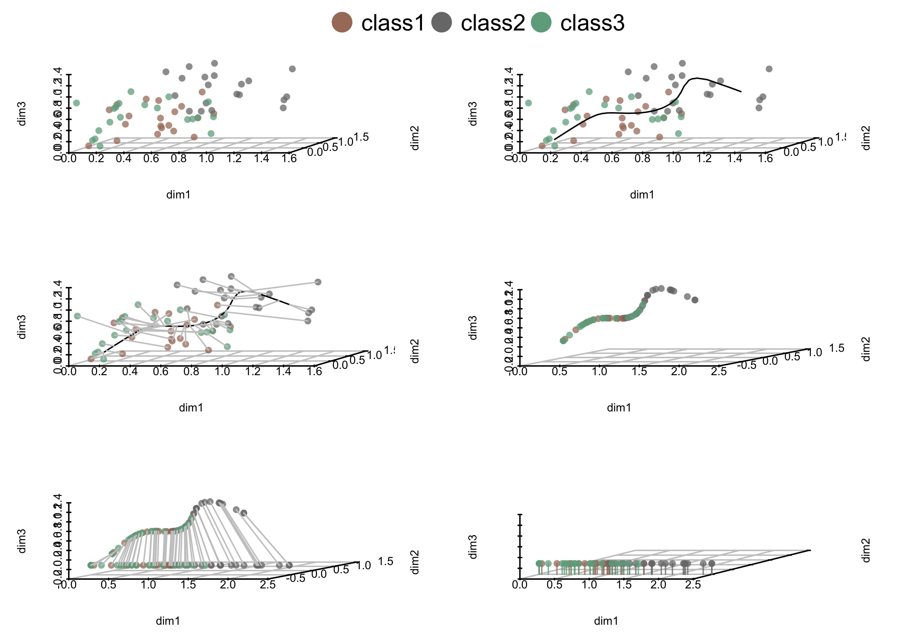
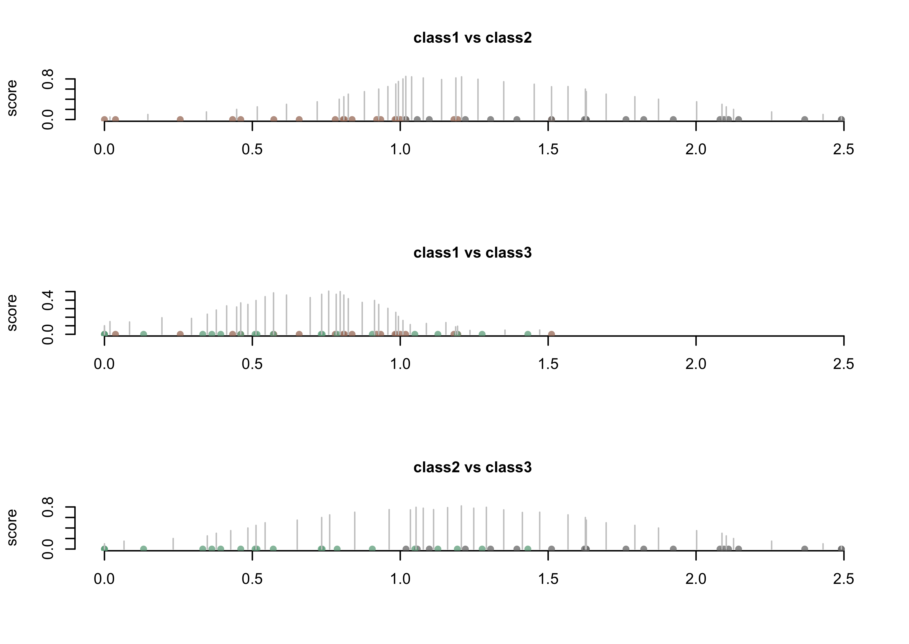
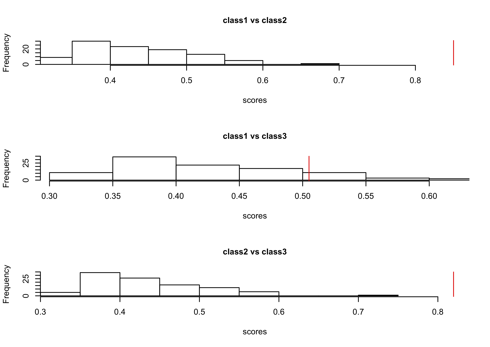

---
output:
  github_document:
    html_preview: false
---

<!-- README.md is generated from README.Rmd. Please edit that file -->


<a href="http://www.bioconductor.org/packages/devel/bioc/html/ClusterSignificance.html#since"></a> <a href="http://bioconductor.org/packages/stats/bioc/ClusterSignificance.html"></a> <a href="https://support.bioconductor.org/t/ClusterSignificance/"></a> <a href="http://www.bioconductor.org/packages/devel/bioc/html/ClusterSignificance.html#svn_source"></a>

Status: Travis CI [](https://travis-ci.org/jasonserviss/ClusterSignificance)

Bioc-release <a href="http://www.bioconductor.org/packages/release/bioc/html/ClusterSignificance.html#archives"></a> <a href="http://bioconductor.org/checkResults/release/bioc-LATEST/ClusterSignificance/"></a>

Bioc-devel <a href="http://www.bioconductor.org/packages/devel/bioc/html/ClusterSignificance.html#archives"></a> <a href="http://bioconductor.org/checkResults/devel/bioc-LATEST/ClusterSignificance/"></a>

Codecov [](https://codecov.io/gh/jasonserviss/ClusterSignificance)

# ClusterSignificance

The ClusterSignificance package is written in [R](https://cran.r-project.org) and can be found hosted at the [Bioconductor](https://www.bioconductor.org) repository via the links below.

* [release](https://master.bioconductor.org/packages/release/bioc/html/ClusterSignificance.html)
* [devel](https://bioconductor.org/packages/devel/bioc/html/ClusterSignificance.html)

## Introduction
The ClusterSignificance package provides tools to assess if clusters, in
e.g. principal component analysis (PCA), have a separation different from
random or permuted data. This is accomplished in a 3 step process *projection*,
*classification*, and *permutation*. To be able to compare cluster
separations, we have to give them a score based on this separation. First, 
all data points in each cluster are projected onto a line (*projection*), after
which the seperation for two groups at a time is scored (*classification*).
Furthermore, to get a p-value for the separation we have to compare the
separation score for our real data to the separation score for permuted data 
(*permutation*).


## Installation
The release version of ClusterSignificance can be installed in R from 
[Bioconductor](https://www.bioconductor.org) as follows:

```{r, eval = FALSE}
source("https://bioconductor.org/biocLite.R")
biocLite("ClusterSignificance")
```

To install the development version use:

```{r, eval = FALSE}
install.packages("devtools")
library(devtools)
install_github("jasonserviss/ClusterSignificance")
```

## Quick Start

While we recommend reading the [vignette](https://bioconductor.org/packages/release/bioc/vignettes/ClusterSignificance/inst/doc/ClusterSignificance-vignette.html), the instructions that follow will allow you 
to quickly get a feel for how ClusterSignificance works and what it is capable of.

Here we utilize the example data included in the ClusterSignificance package 
for the Pcp method.

### Projection

We start by projecting the points into one dimension using the Pcp method. We are able to visualize each step in the projection by plotting the results as shown below.

```{r projection}
library(ClusterSignificance)
classes <- rownames(pcpMatrix)
prj <- pcp(pcpMatrix, classes)
plot(prj)
```



### Classification
Now that the points are in one dimension, we can score each possible seperation and deduce the max seperation score. This is accomplished by the classify command (again we can plot the results afterwards). The vertical lines in the plot represent the seperation score for each possible seperation.

```{r classifyMlp}
## Classify and plot.
cl <- classify(prj)
plot(cl)
```



### Permutation
Finally, as we have now determined the max seperation score, we can permute the data to examine how many permuted max scores exceed that of our real max score and, thus, calculate a p-value for our seperation. Plotting the permutaion results show a histogram of the permuted max scores with the red line representing the real score.

```{r permuteMlp}
## Set the seed and number of iterations.
set.seed(3)
iterations <- 100 

## Permute and plot.
pe <- permute(
	mat = pcpMatrix,
	iter = iterations,
	classes = classes,
	projmethod = "pcp"
)
plot(pe)
```



To calculate the p-value we use the following command.

```{r pValueMlp, echo=FALSE, eval=TRUE, message=FALSE}
pvalue(pe)
```

## Bug Reports and Issues

The Bioconductor support site for the ClusterSignificance package is located [here](https://support.bioconductor.org/t/ClusterSignificance/). Issues and bugs can be reported via Github at: [ClusterSignificance](https://github.com/jasonserviss/ClusterSignificance)

## Citation

Jason T. Serviss, Jesper R. Gådin, Per Eriksson, Lasse Folkersen, Dan Grandér; ClusterSignificance: a bioconductor package facilitating statistical analysis of class cluster separations in dimensionality reduced data, Bioinformatics, Volume 33, Issue 19, 1 October 2017, Pages 3126–3128, [https://doi.org/10.1093/bioinformatics/btx393](https://doi.org/10.1093/bioinformatics/btx393)

Citation information can be found in R using:

```{r, eval = FALSE}
library(ClusterSignificance)
citation("ClusterSignificance")
```


## License
[GPL-3](https://www.r-project.org/Licenses/GPL-3)